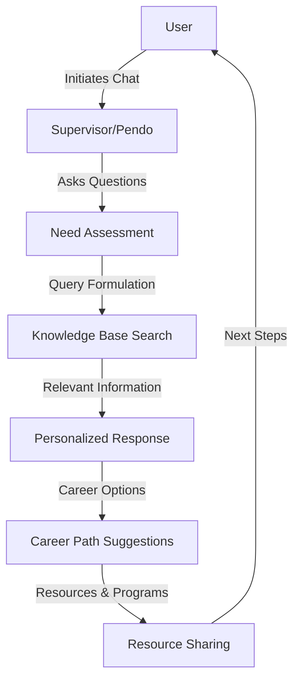
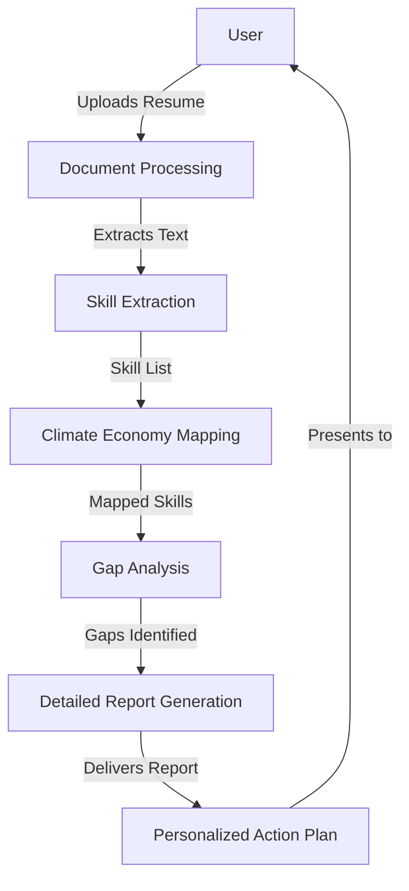
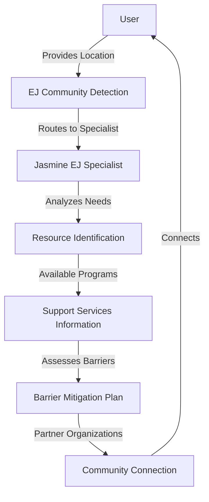
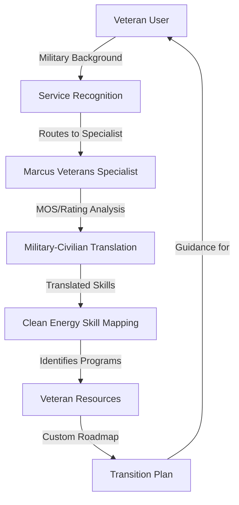
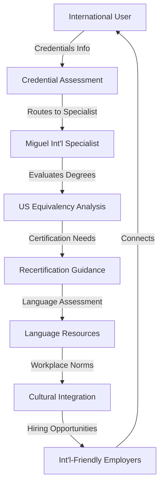
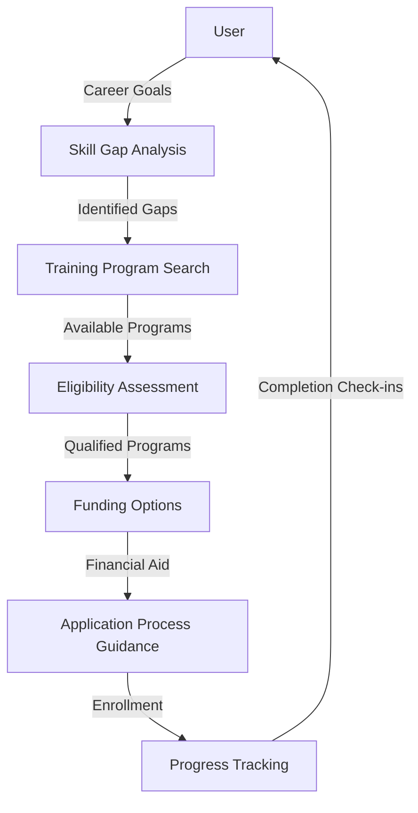
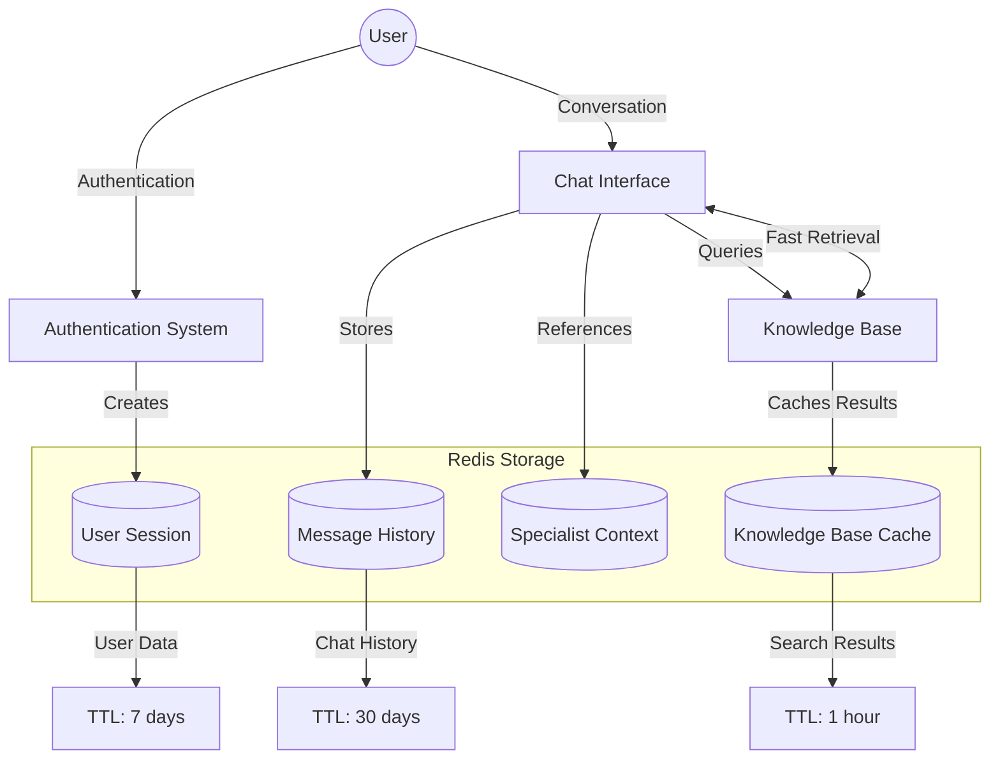
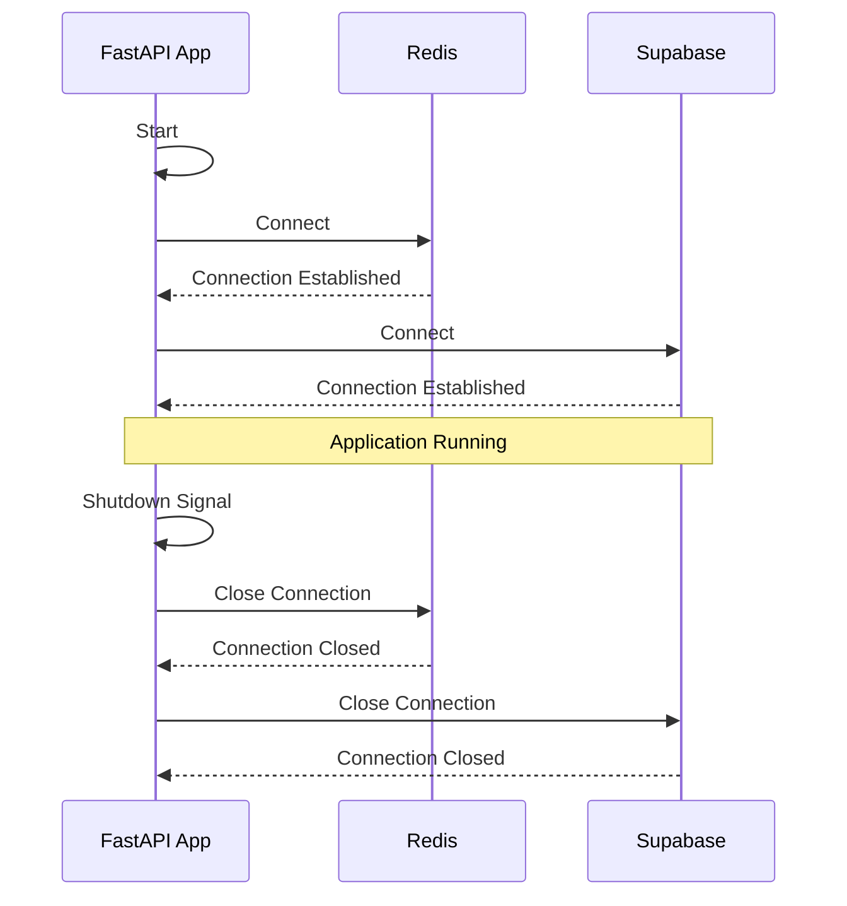

# Climate Ecosystem Assistant (CEA)

The Climate Ecosystem Assistant (CEA) is a state-of-the-art AI application designed to connect underrepresented communities with opportunities across ACT's network of climate solutions companies in Massachusetts. This digital infrastructure addresses critical gaps in the clean energy workforce ecosystem by creating an accessible, AI-powered platform that helps job seekers understand how their existing skills translate to climate economy careers.

## Features

- **Resume Analysis Tool**: Provides users with a climate economy relevance score and skills assessment
- **Personalized Chat Interface**: Offers career guidance through a multi-agent AI system
- **Career Pathways Dashboard**: Shows matched sectors and recommended career paths across:
  - High-Performance Buildings
  - Renewable Energy 
  - Clean Transportation
  - Energy Storage
  - Grid Modernization
  - Offshore Wind
- **Opportunities Browser**: Explore climate jobs from ecosystem partners
- **Training Recommendations**: Personalized training suggestions based on skill gaps
- **Specialized Tools**:
  - Military Skills Translation System for veterans
  - International Credential Evaluation for foreign professionals
  - EJ Community Resources for Gateway Cities residents

## User Flows

The Climate Ecosystem Assistant supports several key user flows to help job seekers navigate clean energy careers:

### General Career Guidance Flow

1. **Initial Interaction**: User initiates conversation with the supervisor agent (Pendo)
2. **Need Assessment**: Pendo asks exploratory questions to understand user background and goals
3. **Knowledge Base Search**: System retrieves relevant information about clean energy careers
4. **Personalized Response**: Pendo provides tailored information based on user's specific interests
5. **Career Path Suggestions**: System recommends potential pathways in the clean energy sector
6. **Resource Sharing**: Relevant resources, training programs, and job opportunities are shared



### Resume Analysis Flow

1. **Resume Upload**: User uploads their resume in PDF, DOCX, or plain text format
2. **Skill Extraction**: System analyzes the resume to identify existing skills and experience
3. **Climate Economy Relevance**: Skills are mapped to clean energy sector requirements
4. **Gap Analysis**: System identifies skills gaps for desired clean energy roles
5. **Detailed Report**: User receives a comprehensive assessment with:
   - Climate relevance score (0-100)
   - Transferable skills analysis
   - Skill gap identification
   - Recommended training opportunities
6. **Guided Action Plan**: Personalized suggestions for next steps to transition into clean energy



### Environmental Justice Community Support Flow

1. **Location Identification**: User identifies their community or neighborhood
2. **EJ Community Detection**: System recognizes if the location is in an environmental justice community
3. **Resource Connection**: Jasmine specialist provides information on:
   - Community-specific training programs
   - Local hiring initiatives
   - Support services for underrepresented communities
   - Transportation assistance
   - Childcare resources
4. **Barrier Assessment**: Jasmine helps identify and address potential barriers to employment
5. **Community Partner Connection**: User is connected to relevant community organizations



### Veterans Transition Flow

1. **Military Background Input**: Veteran user provides information about military role and experience
2. **MOS/Rating Translation**: Marcus specialist translates military occupations to civilian equivalents
3. **Skill Mapping**: Military skills are mapped to clean energy sector requirements
4. **Veteran-Specific Resources**: Information on:
   - GI Bill-eligible training programs
   - Veteran hiring initiatives in clean energy
   - Veteran entrepreneurship opportunities
   - Support services for veteran transition
5. **Personalized Transition Plan**: Custom roadmap for military-to-clean-energy career transition



### International Professionals Flow

1. **Credential Assessment**: Miguel specialist evaluates international degrees and certifications
2. **Equivalency Guidance**: Provides information on US equivalency for foreign credentials
3. **Recertification Pathways**: Identifies necessary steps for professional recognition
4. **Language Support Resources**: Suggests language training resources if needed
5. **Cultural Integration**: Provides guidance on US workplace norms in clean energy sector
6. **International-Friendly Employers**: Identifies companies with track records of hiring international talent



### Training Program Matching Flow

1. **Skill Gap Identification**: System analyzes user's current skills versus career goals
2. **Program Search**: Searches database for relevant training programs
3. **Eligibility Check**: Identifies programs user qualifies for based on background and location
4. **Funding Options**: Provides information on scholarships, grants, and financial assistance
5. **Application Guidance**: Helps user understand application requirements and deadlines
6. **Success Tracking**: Follows up on user progress through training completion



## System Architecture

The CEA uses a LangGraph-based orchestration of multiple AI agents:

- **Pendo**: Supervisor agent with knowledge of the Massachusetts clean energy landscape
- **Liv**: Career development specialist for resume analysis and career pathing
- **Jasmine**: Environmental justice specialist for underserved communities
- **Marcus**: Veterans specialist for military skill translation 
- **Miguel**: International professionals specialist for credential evaluation

```mermaid
graph TD
    User((User)) <-->|Interaction| Supervisor[Pendo - Supervisor]
    
    Supervisor <-->|Career Questions| Liv[Liv - Career Specialist]
    Supervisor <-->|EJ Community| Jasmine[Jasmine - EJ Specialist]
    Supervisor <-->|Military Background| Marcus[Marcus - Veterans Specialist]
    Supervisor <-->|International Credentials| Miguel[Miguel - Int'l Specialist]
    
    Supervisor -->|Orchestrates| Integration[Response Integration]
    Integration -->|Final Response| User
    
    Liv <--> KB[(Knowledge Base)]
    Jasmine <--> KB
    Marcus <--> KB
    Miguel <--> KB
    Supervisor <--> KB
    
    KB <--> RC[(Redis Cache)]
    
    subgraph External Resources
        Training[Training Programs]
        Jobs[Job Listings]
        Partners[Community Partners]
    end
    
    KB <--> External Resources
```

### LLM Configuration System

The CEA implements a flexible LLM configuration system:

- **Multi-Provider Support**: Seamlessly switch between OpenAI, Groq, and Anthropic models
- **Environment-Specific Settings**: Different configurations for development and production
- **Component-Specific Models**: Each agent and component can use the most appropriate model
- **Parameter Overrides**: Easy customization of temperature, token limits, and other parameters

```python
# Example of using the LLM configuration system
from llm import get_openai_llm, get_groq_llm

# Get default OpenAI configuration
default_llm = get_openai_llm()

# Get Groq with custom parameters
creative_llm = get_groq_llm({
    "temperature": 0.2,
    "max_tokens": 8192 
})
```

```mermaid
graph TD
    Config[Configuration System] --> Dev[Development Environment]
    Config --> Prod[Production Environment]
    
    Dev --> OpenAI_Dev[OpenAI Models]
    Dev --> Groq_Dev[Groq Models]
    Dev --> Anthropic_Dev[Anthropic Models]
    
    Prod --> OpenAI_Prod[OpenAI Models]
    Prod --> Groq_Prod[Groq Models]
    
    subgraph Model Parameters
        Temp[Temperature]
        Tokens[Max Tokens]
        TopP[Top P]
        TopK[Top K]
    end
    
    OpenAI_Dev --> Model Parameters
    OpenAI_Prod --> Model Parameters
    Groq_Dev --> Model Parameters
    Groq_Prod --> Model Parameters
    Anthropic_Dev --> Model Parameters
    
    subgraph Agent Assignments
        Pendo[Supervisor - GPT-4]
        Liv[Career - Claude 3]
        Jasmine[EJ - Mixtral]
        Marcus[Veterans - GPT-4]
        Miguel[Int'l - Claude 3]
    end
    
    OpenAI_Prod --> Pendo
    OpenAI_Prod --> Marcus
    Anthropic_Dev --> Liv
    Anthropic_Dev --> Miguel
    Groq_Dev --> Jasmine
```

## State Management

The CEA implements a sophisticated state management system using Redis:



### Authentication and Session Management

- **Session Storage**: User sessions are stored with a 7-day TTL, automatically extending on activity
- **Security Features**: Rate limiting, login attempt tracking, and verification code management
- **User Preferences**: Theme settings, notification preferences stored in session data

### Chat History and Context

- **Persistent Conversations**: Chat history is maintained for 30 days with automatic TTL management
- **Message Structure**: Each message has role, content, timestamp, and optional metadata
- **Specialist Context**: Metadata tracks which specialist agents are involved in conversations
- **User-to-Chat Index**: Fast access to all user conversations through Redis indices

### Knowledge Base Caching

- **Performance Optimization**: Queries are cached with a 1-hour TTL, providing 8x faster responses
- **Fallback Mechanisms**: Multiple redundant methods for retrieval if primary method fails
- **Cache Invalidation**: Automatic and manual methods for refreshing outdated information

## Prerequisites

1. Python 3.8 or higher
2. Supabase project for data storage
3. Redis for caching (required for session management)
4. API keys for one or more LLM providers:
   - OpenAI (primary recommendation for agents)
   - Groq (optional, used for chat interface)
   - Anthropic (optional)

## Setup

1. Clone the repository:
```bash
git clone https://github.com/act-dev-25/agents.git
cd agents
```

2. Create a virtual environment and activate it:
```bash
python -m venv venv
source venv/bin/activate  # On Windows use: venv\Scripts\activate
```

3. Install dependencies:
```bash
pip install -r requirements.txt
```

4. Set up environment variables:
```bash
cp .env.example .env
```

5. Edit the `.env` file with your own credentials:
   - Add your Supabase credentials
   - Set up Redis connection information
   - Add API keys for LLM providers (OpenAI, Groq, etc.)
   - **IMPORTANT**: Never commit your `.env` file with real credentials to version control

6. Verify Redis connection:
```bash
python tests/test_redis_connection.py
```

## Configuration System

The CEA uses a centralized configuration system in `config.py`:

- **Environment Variables**: The app can run in `development` or `production` mode with different settings
- **LLM Configuration**: Model settings, temperature, token limits for each provider
- **Caching Settings**: TTL values for different types of cached data
- **Specialist Configuration**: Settings for when to route to specialist agents
- **Vector Search**: Similarity thresholds and result counts

To modify configurations:

1. For temporary changes, use the parameter override functions
2. For persistent changes, edit the configuration dictionaries in `config.py`
3. For environment-specific settings, use the corresponding section in the config

## Testing

The project includes various test scripts in the `tests` directory:

1. **Redis Connectivity Tests**:
```bash
python tests/test_redis_connection.py
```

2. **Supabase Database Tests**:
```bash
python tests/check_supabase_data.py
```

3. **Redis Cache Demonstration**:
```bash
python tests/redis_cache_demo.py
```

4. **Authentication and Chat State Demo**:
```bash
python tests/auth_chat_redis.py
```

5. **Tools and Functions Tests**:
```bash
python tests/test_tools.py
```

## Security Best Practices

When working with this codebase, always follow these security practices:

1. **Environment Variables**: All sensitive credentials should be stored in the `.env` file which is excluded from version control via `.gitignore`

2. **No Hardcoded Secrets**: Never hardcode API keys, passwords, or other secrets directly in the source code

3. **Service Role Keys**: The Supabase service role key has admin privileges - use it only when necessary and always through secure environment variables

4. **Redis Security**: Ensure Redis is configured with authentication and proper access controls

5. **Regular Rotation**: Periodically rotate all API keys and credentials

6. **Minimal Permissions**: When setting up service accounts, follow the principle of least privilege

## Deployment

The CEA can be deployed using the LangGraph Platform, which provides a scalable infrastructure for running AI agents.

### LangGraph Configuration

The `langgraph.json` file configures how the application is deployed:

```json
{
  "dependencies": ["."],
  "graphs": {
    "climate_assistant": "./graph.py:climate_graph"
  },
  "env": ".env",
  "http": {
    "app": "./webapp.py:app"
  },
  "auth": {
    "type": "custom",
    "custom": {
      "path": "./webapp.py:auth"
    }
  },
  "store": {
    "type": "memory"
  }
}
```

This configuration:
- Registers the `climate_graph` from `graph.py` as the main agent
- Uses the custom FastAPI app from `webapp.py` with custom lifespan events
- Loads environment variables from `.env`
- Uses custom authentication from the `auth` object in `webapp.py`
- Currently uses memory storage (can be configured for persistent storage)

### Lifespan Events

The application uses lifespan events to manage connections to Redis and Supabase:

- **On Startup**: Establishes connections to Redis and Supabase
- **On Shutdown**: Gracefully closes connections to prevent resource leaks



### Deployment Steps

To deploy the application on LangGraph:

1. Install the LangGraph CLI:
```bash
pip install -r requirements-langgraph.txt
```

2. Log in to LangGraph:
```bash
langgraph login
```

3. Deploy to LangGraph Platform:
```bash
langgraph deploy
```

4. For local development and testing:
```bash
langgraph dev --no-browser
```

### API Routes

The deployed service exposes several API endpoints:

- **GET /health**: Public endpoint for checking service health
- **GET /user-info**: Protected endpoint requiring authentication
- **GET /redis-status**: Example route accessing the Redis service

### Production Deployment

For production deployments, consider updating `langgraph.json` to use persistent storage:

```json
"store": {
  "type": "postgres",
  "postgres": {
    "uri": "${POSTGRES_URI}"
  }
}
```

You can also configure authentication to use OAuth, API keys, or custom authentication as required.

## Usage

### Data Initialization

1. Format your Massachusetts clean energy ecosystem data:
   - Ecosystem partners (employers, training providers, community organizations)
   - Knowledge base resources
   - Target audience information

2. Populate Supabase with initial data:
```bash
python supabase/seed.py
```

3. Verify Redis connection:
```bash
python tests/test_redis_connection.py
```

### Running the Assistant

To start the CEA application:

```bash
python app.py
```

The application will:
- Initialize all agent nodes
- Set up the LangGraph structure
- Start the chat interface
- Enable resume analysis capabilities

## Data Structure

### Ecosystem Partners
Partners are stored with the following information:
- name
- description
- partner_type (employer, education, community, government, nonprofit)
- partnership_level
- website
- url_patterns (job listings, programs, events, etc.)
- climate_focus_areas
- region

### Knowledge Base
The knowledge base stores:
- Clean energy sector information
- Training programs
- Job descriptions
- Success stories
- Community resources

### User Profiles
User profiles maintain:
- Background information
- Resume analysis results
- Skill assessments
- Career preferences
- Training recommendations

## Redis Key Patterns

CEA uses the following Redis key patterns:

- **Sessions**: `session:{session_id}` - User session data
- **User Session Index**: `user:{user_id}:sessions` - Set of active sessions
- **Chats**: `chat:{chat_id}` - Chat metadata
- **Messages**: `chat:{chat_id}:messages` - List of messages in a chat
- **User Chat Index**: `user:{user_id}:chats` - Set of user chats
- **Authentication**: `auth:login_attempt:{email}:{ip}` - Login attempt counter
- **Verification**: `auth:verification:{email}` - Email verification codes
- **Cache**: `kb_search:{query}` - Cached knowledge base search results

## Performance Considerations

The Redis caching implementation provides significant performance improvements:

- **Cached Queries**: ~0.22 seconds (vs. 1.8 seconds for database queries)
- **Session Retrieval**: <10ms for retrieving user context
- **Chat History**: O(1) lookup time for chat metadata, O(n) for message retrieval

## Repository

This project is hosted at: https://github.com/act-dev-25/agents.git

## Contributing

1. Fork the repository
2. Create a feature branch
3. Commit your changes
4. Push to the branch
5. Create a Pull Request

## License

[Add your license information here] 